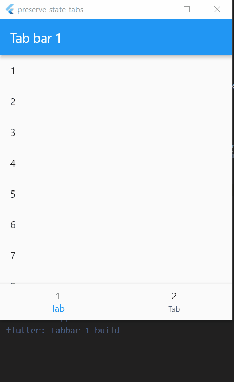

# Preserve Bottom Navigation Tabbar State

Bottom tab pages initalizes every time we switch between them. We usually just want to initialize once. This project shows various techniques of how to preserve them.  

### Here's the [article](https://nikkigoel.com/state-persistence-techniques-for-the-flutter-bottom-navigation-bar) related to this project.

## Demo

<center> </center>

## How to run the project

### - Run on [dartpad](https://dartpad.dev/)

### - Run locally on your device

#### Requirements:
- Flutter should installed in your device.

#### Steps to run:

1. Download and open the zip file or clone the repository.

```
git clone https://github.com/nicks101/flutter_tutorials
```

2. Navigate to the root folder.

```
cd flutter_tutorials
```

3. Install the pub dependencies.
```
flutter pub get
```

4. Run the app.
```
flutter run
```